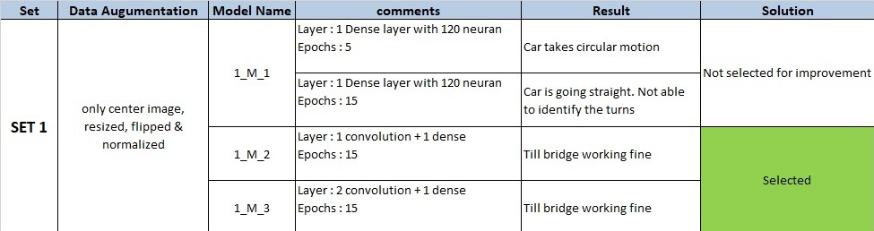
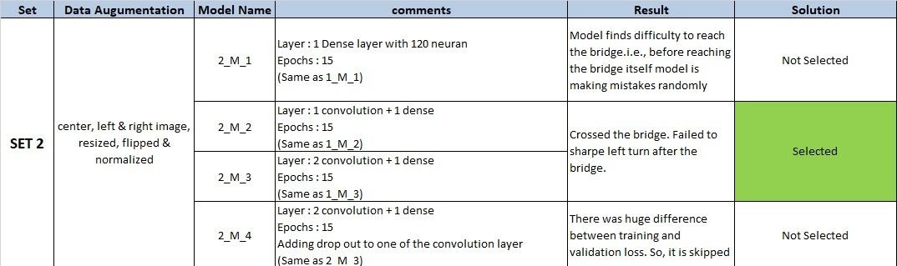
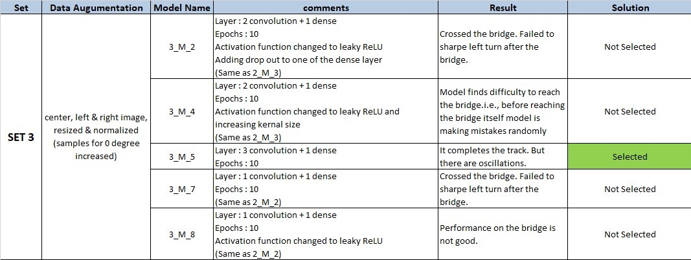
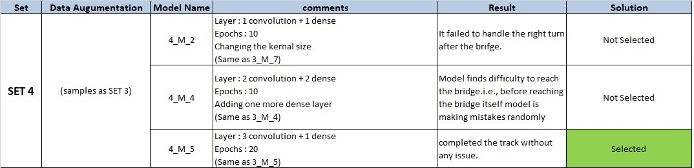
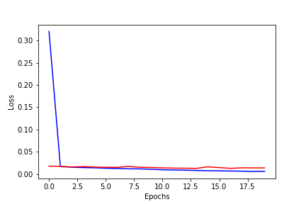

# **Behavioral Cloning** 
---

**Behavioral Cloning Project**

The goals / steps of this project are the following:
* Use the simulator to collect data of good driving behavior
* Build, a convolution neural network in Keras that predicts steering angles from images
* Train and validate the model with a training and validation set
* Test that the model successfully drives around track one without leaving the road
* Summarize the results with a written report


## Rubric Points
### Here I will consider the [rubric points](https://review.udacity.com/#!/rubrics/432/view) individually and describe how I addressed each point in my implementation.  

---

### Files Submitted & Code Quality

#### 1. Submission includes all required files and can be used to run the simulator in autonomous mode
My project includes the following files:
* `model.ipynb` containing the script to create and train the model
* `drive.py` for driving the car in autonomous mode
* `model.h5` containing a trained convolution neural network 
* `writeup_report.md` summarizing the results

#### 2. Submission includes functional code
Using the Udacity provided simulator and my drive.py file, the car can be driven autonomously around the track by executing 
```sh
python drive.py model.h5
```

#### 3. Submission code is usable and readable

The `model.ipynb` file contains the code for training and saving the convolution neural network. The file shows the pipeline I used for training and validating the model, and it contains comments to explain how the code works.

### Model Architecture and Training Strategy

#### 1. An appropriate model architecture has been employed

My model consists of a convolution neural network with 5x5 filter sizes and depths between 6 and 120 (`model.ipynb` file, cell 12) 

The model includes LeakyReLU layers to introduce nonlinearity, and the data is normalized in the model using a Keras lambda layer. 

#### 2. Attempts to reduce overfitting in the model

Overfitting is controlled by following steps.
* In each convolution layer, I have used *Max Pooling*. It helps in reducing the dimension as well as makes neurans to perform better. 
* Using data augumentation techniques, I have distributed the training data across all the output class.
* In addition to that, the model was trained and validated on different data sets to ensure that the model was not overfitting (code line 10-16). The model was tested by running it through the simulator and ensuring that the vehicle could stay on the track.

#### 3. Model parameter tuning

* `Learning rate` : The model used an adam optimizer, so the learning rate was not tuned manually (`model.ipynb` file, cell 12, line 40).

#### 4. Appropriate training data

I have used Udacity training data. There were **Three** images(Center,Left,Right) for every frame and steering angle for center image. We have *8036* frame details. So, totally there were *24108* images given as input.


***Data Distribution Of Given Input Data***


From the above graph, it is observed that we didn't have same amount of data in each output classes. we can achieve equal distribution by two ways.
1. We can improve the samples for output classes which are lower
2. Reducing the samples which has large amount of data

I chose the second way. As most of the data has roughly 300 images in an average, increaing these output classes is not the good choice. For the given problem, we don't require these much data also. So, I have selected only maximum of 200 images per output class. Additionaly, I have skipped output classes which has less then 10 images.


***Data Distribution Of Selected Data***


The above data is comparatively well distributed. Agin, this is not evenly distributed in all output classes. As we don't take large turn everytime. Mostly we drive straightly with slight turn. So, these selected data will work without any issue.

I have used a combination of central, left and right images for training my model. This will help in recovering from the left and right sides of the road. 

For details about how I created the training data, see the next section. 

### Model Architecture and Training Strategy

#### 1. Solution Design Approach
I have divided the problem into Data Augumentation & Building the neural network. For each change in the data set, I will check my model on different model architecture. From each set, minimum one model will be selected for further improvement.

***SET 1 :***


***SET 2***


***SET 3***


***SET 4***

> **Note :** For each SET seperate python notebook is used. These notebooks are also uploaded with results for reference.(For example : `SET 1` uses `1_Mode_Training.ipynb` respectively)

#### 2. Final Model Architecture
My final model consists of **Four** hidden layers.( 3 Convolution layer followed by one dense layer)

| Layer         		|     Description	        					| 
|:---------------------:|:---------------------------------------------:| 
| Input         		| 160x320x3    						            | 
| Resizing Image        | 85x320x3                                      |
| Convolution 5x5     	| 1x1 stride, valid padding, outputs 81x316x6 	|
| Leaky ReLU Activation													|
| Max pooling	      	| 2x2 stride,  2x2 filter, outputs 40x158x6		|
| Convolution 5x5     	| 1x1 stride, valid padding, outputs 36x154x36 	|
| Leaky ReLU Activation													|
| Max pooling	      	| 2x2 stride,  2x2 filter, outputs 18x77x3	    |
| Convolution 5x5     	| 1x1 stride, valid padding, outputs 14x73x120 	|
| Leaky ReLU Activation													|
| Max pooling	      	| 2x2 stride,  2x2 filter, outputs 7x36x120	    |
| Fully connected#1		| 30240 input, 256 output				        |
| Fully connected#2		| 256 input, 1 output     				        |


#### 3. Creation of the Training Set & Training Process
**Training Set Selection :**

As discussed in the previous section, apart from 24108 training images 10818 images selected. Among them 20 percent of the images are used for validation.
The input data is distributed among all output classes to avoid biased output. The whole data set is shuffled to get random classes in each batch.


**Data Augumentation :**

The upper portion of the image not required for detecting the lanes. so, we are slicing the images in the following way. This will reduce the computation cost as well as increase the accuracy.
> Input Image :
>> 

> Output Image :
>> 

The cropped image is normalized using the below formulae:
```python
>> x=(x/255.0)-0.5
```
**Training Process :**

* Among 80% of input data is taken for training and remaining 20% for validation.
* A batch of 32 augumented image is evaluated by my model
* The loss will be calculated using `Mean Square Error` function.
* Depending upon the loss, `Adam optimizer` will update the weights by back propogation algorithm
* This process is continued for all the batches in our training data. Then, the model is evaluated against the validation data

The whole training process is repeated for 20 cycle (Epochs). I am plotting the Epochs Vs Loss function to understand the behaviour of my model

>  
>>Red line  : Validation loss

>>Blue line : Training loss
